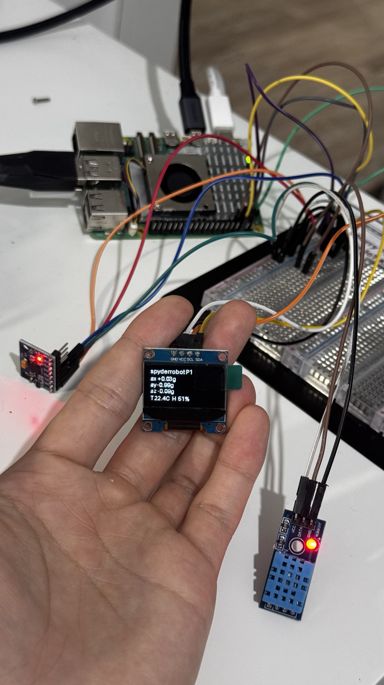

# spyderrobot

> Quadruped robot performs spider motion using 12 servo motors, Rpi5, and several sensors

A **sensorised quadruped platform for remote environmental awareness and robot-state monitoring.**

The robot is the carrier; the engineering deliverable is a **custom MCU-based sensing/monitoring board** that integrates with a Raspberry Pi 5 to log environmental data, monitor power and platform health, and stream telemetry while the robot operates in hazardous or hard-to-access areas.

---

## Project status

| Phase | Description | Status |
|---|---|---|
| 0 | Repo restructure & documentation | **done** |
| 1 | Breadboard prototype (IMU + env + OLED on Pi) | **done** |
| 2 | MCU firmware on STM32 dev board | pending |
| 3 | Custom PCB design (KiCad) | pending |
| 4 | PCB fabrication & bring-up | pending |
| 5 | Integration on quadruped chassis | pending |
| 6 | Power & robot-state monitoring upgrade | pending |
| 7 | Field test & write-up | pending |

Detailed milestones with deliverables and exit criteria: see [`docs/08-roadmap-milestones.md`](docs/08-roadmap-milestones.md).

### Phase 1 first light



The SSD1306 is held in frame rendering `spyderrobot P1` + live accelerometer values + environmental temperature / humidity from the logger. Wiring cheat sheet: [`docs/phase1-wiring.md`](docs/phase1-wiring.md). The off-by-one bug in the logger's CSV-column indexing that this rig exposed is documented in [`docs/11-fault-record.md`](docs/11-fault-record.md).

---

## System architecture (Option A)

```
                    +-----------------------------+
                    |     Raspberry Pi 5          |
                    |  - telemetry logging        |
                    |  - dashboard / interface    |
                    |  - Pi AI camera handling    |
                    |  - operator UI              |
                    +--------------+--------------+
                                   | UART / I²C
                                   |
                    +--------------v--------------+
                    |   Custom STM32 MCU board    |
                    |   (the main deliverable)    |
                    |  - sensor acquisition       |
                    |  - power / current monitor  |
                    |  - IMU (tilt / shock)       |
                    |  - environmental sensors    |
                    |  - watchdog / safety        |
                    +---+----+----+----+-----+
                        |    |    |    |
                        |    |    |    +------> ultrasonic (HC-SR04)
                        |    |    +-----------> temp/humidity (DHT11 → BME280)
                        |    +----------------> IMU (MPU6050 prototype → MPU9250 v1)
                        +---------------------> INA226 (planned)

                    +-----------------------------+
                    |   External modules (off-board v1) |
                    |  - PCA9685 servo driver     |
                    |  - 12× MG996R servos        |
                    |  - OLED / LCD / joystick    |
                    +-----------------------------+
```

Full architecture: [`docs/02-system-architecture.md`](docs/02-system-architecture.md).

---

## What's in this repo

| Path | What it is |
|---|---|
| [`spider/`](spider/) | **Existing** ROS / catkin URDF package — mechanical model + meshes exported from SolidWorks. Used for simulation in RViz / Gazebo. See [`docs/07-mechanical-simulation.md`](docs/07-mechanical-simulation.md). |
| [`docs/`](docs/) | All engineering documentation: architecture, BOM, PCB spec, firmware design, test plan, roadmap, fault log, vision. |
| `hardware/` | KiCad PCB project, schematics, enclosure files (scaffolded — to be filled in Phase 3). |
| `firmware/` | STM32 firmware project + tests (scaffolded — to be filled in Phase 2). |
| `pi/` | Pi-side Python code: telemetry logger, camera capture, operator interface (scaffolded — to be filled in Phase 1). |
| `assets/` | Photos, board renders, system diagrams. |

---

## Skills demonstrated by this project

- Custom **PCB design** (schematic capture → layout → fab → bring-up) in KiCad
- **STM32** firmware in C with HAL, sensor drivers, and a deterministic comms protocol over UART
- **Sensor integration**: I²C / SPI / 1-Wire / analog
- **Power and current monitoring** (INA226) and battery management
- **System integration** of MCU, SBC (Pi 5), servo driver, and a real mechanical chassis
- Documented engineering process: design decisions, test plans, fault log

---

## Hardware (current prototype → planned)

| Subsystem | Prototype (Phase 1) | v1 end product |
|---|---|---|
| Temp / humidity | DHT11 | BME280 or SHT31 |
| Air quality | — | BME680 (later) |
| Distance | HC-SR04 ultrasonic | (kept) |
| IMU | MPU6050 | **MPU9250** |
| Power monitor | — | INA226 |
| Compute (high-level) | Raspberry Pi 5 | (kept) |
| MCU (board) | STM32 (Nucleo dev → custom PCB) | STM32G4/F4 family |
| Servo driver | PCA9685 (off-board) | integrated on v2 PCB |
| Servos | 12× MG996R | (kept) |
| Camera | Raspberry Pi AI Camera | (kept) |
| Display | 0.96" OLED / LCD1602 | (kept) |
| Input | PS2 joystick | (kept) |

Full BOM with part numbers and suppliers: [`docs/03-hardware-bom.md`](docs/03-hardware-bom.md).

---

## Documentation index

| # | Document | Purpose |
|---|---|---|
| 01 | [Project overview](docs/01-project-overview.md) | Problem statement, scope, what it is *not* |
| 02 | [System architecture](docs/02-system-architecture.md) | Block diagram, comms topology, power tree |
| 03 | [Hardware BOM](docs/03-hardware-bom.md) | Parts list (prototype + target v2) |
| 04 | [PCB design](docs/04-pcb-design.md) | Custom MCU board spec, functional blocks |
| 05 | [Firmware architecture](docs/05-firmware-architecture.md) | STM32 firmware structure, drivers, comms protocol |
| 06 | [Pi software](docs/06-pi-software.md) | Pi 5 telemetry, dashboard, camera, UI |
| 07 | [Mechanical & simulation](docs/07-mechanical-simulation.md) | The existing `spider/` ROS package |
| 08 | [Roadmap & milestones](docs/08-roadmap-milestones.md) | Phased deliverables and exit criteria |
| 09 | [Test & validation](docs/09-test-and-validation.md) | Subsystem and integration test plan |
| 10 | [Design decisions](docs/10-design-decisions.md) | ADR-style log of "why we chose X" |
| 11 | [Fault record](docs/11-fault-record.md) | Running log of bugs, root causes, fixes |
| 12 | [Ultimate vision](docs/12-ultimate-vision.md) | The long-term north-star spec |

---

## License

[MIT](LICENSE)
